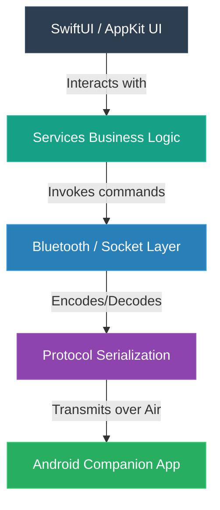

# 📐 DialWave Architecture Guide

DialWave is a native companion application suite for macOS and Android, prioritizing local, offline-first, and Bluetooth-first communication.

---

## 👁️ Vision
DialWave turns the Mac into an extension of an Android phone by establishing a secure local channel over Bluetooth (with Wi-Fi fallback), requiring **no cloud dependency** or internet connection.

### Core Capabilities
*   **Incoming Call HUD:** Displays real-time incoming call overlays on macOS.
*   **Call Control:** Direct options to answer, reject, or terminate active phone calls.
*   **Dialer Integration:** Initiate outgoing calls on the phone from macOS.
*   **Contact Directory:** Browse and search synchronized Android contacts.
*   **Call Log Browser:** View complete phone logs (incoming, outgoing, missed) with click-to-callback.
*   **SMS Client:** Receive text notifications, browse threads, and reply from the desktop.
*   **Notification Mirroring:** Mirror selected notifications from Android to the Mac notification center.

---

## 🎨 Design Principles
*   **Native First:** Built purely on SwiftUI, AppKit (where required), AVFoundation, and CoreBluetooth. **Never** Electron, React Native, or Flutter.
*   **Offline First:** All operations run locally; internet connectivity is never requested or required.
*   **Bluetooth-First:** Primary transport is established via RFCOMM, using Wi-Fi socket upgrades as high-throughput fallbacks.
*   **Modular Architecture:** Strict single-responsibility principle for modules to prevent God classes and bloated source files.

---

## 📁 Repository Structure

```text
DialWave/
├── mac/                          # macOS Native Application
│   ├── DialWave.xcodeproj        # Xcode Project
│   └── DialWave/                 # Source Files
│       ├── App/                  # App Entry Point & Environment
│       │   ├── DialWaveApp.swift
│       │   ├── AppDelegate.swift
│       │   └── Environment.swift
│       ├── UI/                   # User Interface Components
│       │   ├── ContentView.swift
│       │   ├── MenuBar/          # Menubar Status Items & Views
│       │   ├── Windows/          # Settings & Floating HUD Windows
│       │   ├── Popovers/         # Popover UI Controllers
│       │   └── Components/       # Reusable UI Controls
│       ├── Bluetooth/            # Bluetooth Core Stack
│       │   ├── BluetoothManager.swift
│       │   ├── ConnectionManager.swift
│       │   ├── Discovery.swift
│       │   └── RFCOMM.swift
│       ├── Services/             # Business Logic & Core Services
│       │   ├── CallService.swift
│       │   ├── ContactService.swift
│       │   ├── SMSService.swift
│       │   ├── NotificationService.swift
│       │   └── SettingsService.swift
│       ├── Models/               # Data Objects
│       ├── Protocol/             # Protocol Codable Objects
│       │   ├── Message.swift
│       │   ├── Command.swift
│       │   └── Event.swift
│       ├── Storage/              # SQLite Database & Preferences Cache
│       ├── Utils/                # Foundation Helpers & Extensions
│       └── Resources/            # Assets, Icons, and Media
├── android/                      # Android Companion Application
│   ├── app/                      # Main Android Application Module
│   ├── bluetooth/                # Bluetooth RFCOMM / Socket Server
│   ├── telecom/                  # ConnectionService & Call Handling
│   ├── contacts/                 # ContactsContract Resolver
│   ├── sms/                      # BroadcastReceivers & SmsManager Interceptor
│   ├── protocol/                 # Shared Message Payloads
│   └── utils/                    # Loggers & Helpers
├── protocol/                     # Cross-Platform Protocol Docs
│   ├── protocol.md               # JSON Communication Protocol Spec
│   └── schema.json               # Payload JSON Schema Validation
├── docs/                         # Detailed Feature Specifications
│   ├── architecture.md
│   ├── bluetooth.md
│   ├── roadmap.md
│   ├── ui.md
│   ├── api.md
│   └── permissions.md
├── assets/                       # Branding & Design Assets
├── scripts/                      # Build & Automation Scripts
├── README.md                     # Project Overview
└── LICENSE                       # License Terms
```

---

## 🗺️ Architectural Layers



> [!NOTE]
> **Strict Layer Isolation:** Every layer communicates only with the layer directly below it. The UI never interacts directly with the Bluetooth socket layer, and protocol serialization occurs in a dedicated module.

### Core Modules Detail

1.  **UI:** Responsible purely for rendering views. It consumes state from Services and calls Service methods to handle interactions.
2.  **Bluetooth / Connection:** Manages discovery, pairing, socket lifecycles (RFCOMM / TCP), reconnect loops, and raw stream output.
3.  **Protocol:** Acts as the shared contract. Encapsulates all models in JSON serialization.
    *   *Example Incoming Call Payload:*
        ```json
        {
          "type": "incoming_call",
          "number": "+919876543210",
          "contact": "Mom"
        }
        ```
4.  **Services:** Handles application business logic (e.g., orchestrating active calls, queueing unsent SMS, caching profiles).
5.  **Storage:** Local persistence layer for SQLite data, cached contacts, messaging history, and client configuration.

---

## 🚀 Development Roadmap

| Phase | Module | Objective | Details |
| :--- | :--- | :--- | :--- |
| **Phase 1** | **Foundation** | macOS Skeleton | Menu bar daemon setup, status icon representation, initial settings panel. |
| **Phase 2** | **Bluetooth** | Discovery & Pairing | Implement scan, pair, connect, and basic RFCOMM ping/pong. |
| **Phase 3** | **Protocol** | Negotiation | JSON payload schema parser, heartbeats, version compatibility checks. |
| **Phase 4** | **Call Control** | Voice Triggers | Incoming call popups, Answer / Reject hooks, Dial from macOS. |
| **Phase 5** | **Contacts** | Synchronization | Bulk ContactContract parsing, local sqlite storage, UI contact browser. |
| **Phase 6** | **SMS** | Conversation UI | Text notification mirrors, conversation threading, reply composer. |
| **Phase 7** | **Call History** | Logging | Sync log arrays (missed, dial, answered) to local history DB. |
| **Phase 8** | **Notifications**| Push Mirroring | Intercept Android notification center, display via macOS user notification. |
| **Phase 9** | **Production** | Stability | Auto-reconnect handling, Launch at Login helper, release validation. |

---

## 📏 Coding Standards & Architecture Rules

*   **File Limits:** No single source code file should exceed **300 lines of code**. Keep modules small.
*   **Function Limits:** Maximum function size is **40 lines of code**. Break down large functions into helper methods.
*   **Service Design:** Every service class must implement a single responsibility.
*   **Typed Protocols:** Avoid ad-hoc string parsing or manual dictionary lookup for incoming sockets. Every message type must map to a Swift Codable type in the `Protocol` module.

---

## 🌿 Git Branch Policy

```text
  main (production releases)
   ▲
   │ (merge requests / tags)
  develop (integration branch)
   ▲
   ├─► feature/menubar
   ├─► feature/bluetooth
   ├─► feature/calls
   ├─► feature/sms
   ├─► feature/contacts
   └─► feature/android
```

---

## 🎯 Long-Term Goal
Create the premier open-source macOS ⇄ Android bridging solution. It must remain **highly native**, **performant**, **private (offline)**, **beautiful**, and **developer-friendly**.