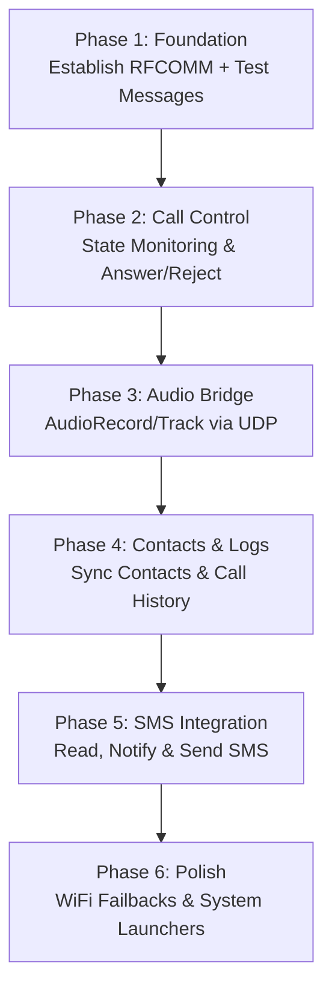

# 🌊 DialWave

DialWave is a modern integration suite designed to bridge macOS and Android devices seamlessly. It brings call control, real-time audio routing (bypassing macOS SCO restrictions), contact synchronization, call logs, and SMS directly to the macOS menubar.

---

## 🏗️ Architecture & Component Status

DialWave consists of two primary applications communicating bidirectionally:

| Component | Language | Framework | Status | Notes |
| :--- | :--- | :--- | :--- | :--- |
| **macOS App** | Swift 6.2.3 | SwiftUI + AppKit | In Progress | Menubar-only daemon, no Dock icon. |
| **Android App** | Kotlin | Android SDK | Not Started | Background service + configuration UI. |

---

## ⚡ Feature Map

### 📞 Call Control
*   [ ] **Incoming Call Popup:** Real-time HUD showing caller details on macOS.
*   [ ] **Answer/Reject:** Control call state directly from the popup.
*   [ ] **Dial from Mac:** Initiate outgoing calls by entering a number or clicking a contact.
*   [ ] **Hang Up:** Terminate active calls from the Mac.

### 👤 Contact & History Sync
*   [ ] **Samsung/Android Contacts Sync:** Fetch and store contacts locally in SQLite on macOS.
*   [ ] **Search:** Quick-search contact list.
*   [ ] **Click-to-Call:** Seamless transition from contact card to active call.
*   [ ] **Call Log History:** View missed, incoming, and outgoing history with callback buttons.

### 💬 SMS Integration
*   [ ] **Real-time SMS Popups:** Receive instant notifications of new texts.
*   [ ] **Threaded Conversations:** View conversation history in the menubar popover.
*   [ ] **Direct Reply:** Compose and send SMS responses from the Mac.

### 🛜 Connection & System
*   [ ] **Bluetooth RFCOMM Handshake:** Auto-discovery and initial pairing.
*   [ ] **WiFi Socket Upgrade:** Automatic upgrade to TCP/UDP sockets for primary communication.
*   [ ] **Menubar Daemon:** Silent running with status indicator in the Mac status bar.
*   [ ] **Launch at Startup:** Automatically run the macOS agent on boot.

---

## 🗺️ Implementation Roadmap

### 📍 Phase 1: Foundation (Current Phase)
*Goal: macOS and Android bidirectional test messaging over Bluetooth RFCOMM.*
1. Build minimal Swift menubar daemon skeleton.
2. Build minimal Kotlin Android app.
3. Establish Bluetooth RFCOMM socket connection between devices.
4. Send verification ping/pong messages Mac ⇄ Android.

### 📍 Phase 2: Call Control
*Goal: Detect, answer, reject, and dial calls from Mac.*
1. Listen for `PHONE_STATE` changes on Android.
2. Push JSON-serialized state events to macOS.
3. Render HUD popup on macOS for incoming calls.
4. Issue `ANSWER`, `REJECT`, or `DIAL` command payloads back to Android.

### 📍 Phase 3: Audio Bridge
*Goal: Stream call audio to/from macOS mic & speakers over local network.*
1. Capture raw PCM phone call audio on Android using `AudioRecord`.
2. Stream raw audio over UDP socket to Mac (bypassing SCO limits).
3. Play incoming stream on Mac using `AVFoundation`.
4. Capture macOS microphone input and stream UDP packets back to Android.
5. Inject mic stream into call audio path via `AudioTrack`.

### 📍 Phase 4: Contacts & Call Logs
*Goal: Sync phone directory and call histories to macOS.*
1. Read Android `ContactsContract` and `CallLog.Calls`.
2. Bulk-transfer JSON payloads to macOS SQLite local storage.
3. Build search-friendly SwiftUI Contacts list and Call Log views.

### 📍 Phase 5: SMS Integration
*Goal: Full SMS reading and reply capability from macOS menubar.*
1. Android background listener monitors incoming SMS.
2. Forward payload to macOS popover interface.
3. Transmit reply strings back to Android for dispatch via `SmsManager`.

### 📍 Phase 6: Polish
*Goal: Production-ready stability, packaging, and UI polish.*
1. Implement reconnect logic, WiFi-to-Bluetooth fallbacks, and socket recovery.
2. Package macOS App as a signed `.app`.
3. Package Android application as a release-ready `.apk`.

---

## 🛡️ Known Challenges & Solutions

### 1. macOS SCO Audio Blocking
> [!CRITICAL]
> macOS blocks userland apps from accessing Bluetooth SCO channels directly.
*   **Solution:** Bypass SCO entirely. DialWave captures audio directly on the Android device via `AudioRecord` and routes it to the Mac over a local WiFi UDP socket, injecting microphone data back into the call path via `AudioTrack`.

### 2. Android Silent Call Answering Restrictions
> [!WARNING]
> Android prevents apps from answering calls silently without elevated permissions.
*   **Solution:** Explicitly request the standard `ANSWER_PHONE_CALLS` permission in the manifest, fallback to an Accessibility Service if required on specific devices (e.g. Samsung).

### 3. Bluetooth RFCOMM Reliability on macOS
> [!NOTE]
> The macOS Bluetooth stack is famously unstable for long-running RFCOMM connections.
*   **Solution:** Use Bluetooth RFCOMM solely for initial handshake and discovery. Once connected, upgrade the link to a high-speed WiFi TCP/UDP socket for all payloads and audio streams.

---

*DialWave Project — Initialized June 2026*
